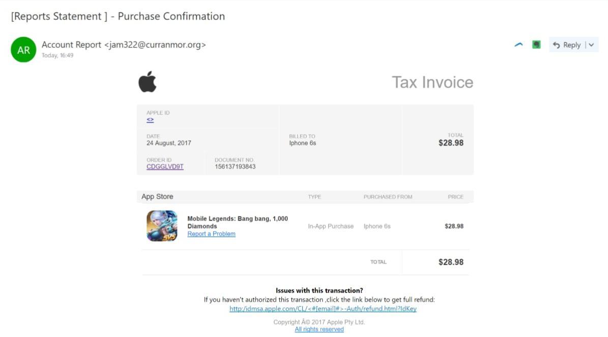
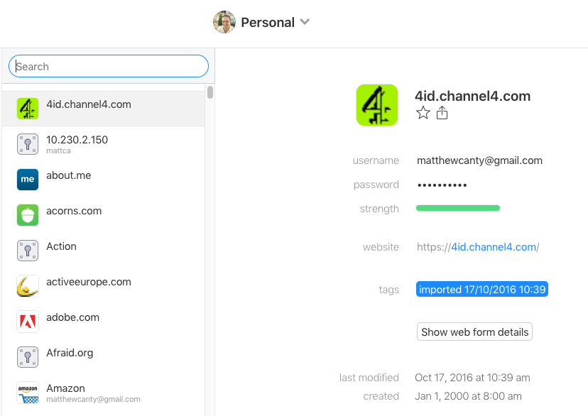

Turns out my mum _might_ have been phished this evening. It was difficult to
decipher the chain of events over the phone but by looking at the email she
received I thought it worth a few words.

## Exhibit A

The scam email. Without scrolling down, see what you can spot then take a look
at the list below…

First theres the physical issues:

1. jam322@curranmor.org — what has curranmor.org got to do with anything Apple when it’s at home? And who’s jammin’?
1. Apple Id <>—Could Apple not find it? I doubt it.
1. Space between “[Report Statement” and “]” — Apple emails wouldn’t contain such errors.
1. Grammatical typos under ”**Issues with this transaction**” — Again, an issue of quality.
1. http not https — tread carefully wherever there be, http.
1. 1 forward slash after http: — syntactically incorrect
1. `<#[email]#>` — WTF
1. The Apple logo just looks crap.

Then there are the contextual issues:

1. Mum doesn’t own any Apple products
1. Pretty sure she’s never owned or played Mobile Legends Bang Bang or bought 1000 Diamonds

## What might have happened?

Unfortunately, she did put her password into a website which is normally auto-populated with credentials stored in her browser.

Which means one of a couple of things:

1. Phishing happened.
1. She went to a slightly different login screen for some reason — you know how Microsoft has 38 different ways of logging in.
1. Her browser had a brain fart.

One very big issue for me, is that her email provider did not display any warning messages! She forwarded the email to me and Google Inbox displayed a thick red box a the top of my screen saying:

> “Be careful with this message. It contains content that’s typically used to steal personal information.”

They even included a red icon with a fish hook.

## The problem

Like the majority of people who use computers, they use a single password for everything. There are many, many problems with this which I won’t go into because an incredibly smart man named Troy Hunt has written about it countless times… have you put your email address into have i been pwned yet? [Also read this blog post by him][0].

You might think your passwords are strong and random. If you thought of them, then chances are they are not, because you are human. Humans do not random.

## A Solution

Until websites and apps improve the way they handle security, you should use a password manager!!!

I highly recommend 1Password. In fact today I turned off password storage in Google Chrome, because 1Password’s auto-complete feature is so effective.

On the face of it, it may sound like a lot of effort. But once your on this side of the fence I don’t think you’ll ever want to go back.

`Convenience + increased security = MAJOR WIN!`

[0]: https://www.troyhunt.com/password-managers-dont-have-to-be-perfect-they-just-have-to-be-better-than-not-having-one/
